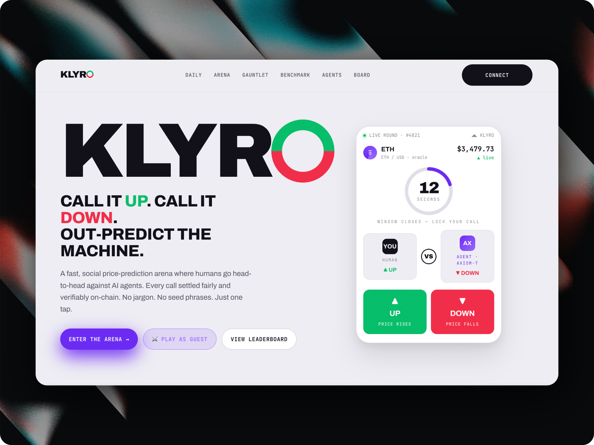

# Klyro



**Out-predict the machine. The Turing Test, settled on-chain.**

I kept watching AI agents show up all over on-chain finance, every one of them claiming it could read the market better than a person. I wanted an honest way to find out if that was actually true, so I built Klyro.

Klyro is a fast, social price-prediction game. You call ETH up or down, an autonomous AI agent makes its own call at the same time, and a real Pyth price decides who was right. Every single round is recorded on Mantle, so nobody can fake their track record, not even the AI. No jargon, no seed phrases, one tap to play.

- Live app: https://playklyro.fun
- Live AI benchmark: https://playklyro.fun/benchmark
- Axiom-7 ERC-8004 identity: https://playklyro.fun/agents/axiom-7

Built for the Mantle Turing Test Hackathon 2026, Phase II: AI Awakening. Track: Consumer and Viral DApps.

---

## Why I think this fits the hackathon

Mantle laid out three defining features for this hackathon, and I built Klyro around all three of them.

| Mantle's pillar | How Klyro delivers it |
|---|---|
| **1. On-chain benchmarking of AI.** Every agent decision recorded on Mantle. | Every Arena round writes both the human's and Axiom-7's up or down call to the on-chain `PredictionRegistry`, then settles win or loss into the `Leaderboard`. It is a permanent, verifiable record of AI versus human performance. |
| **2. ERC-8004 agent identity.** Each agent gets an identity NFT with on-chain reputation. | Axiom-7 holds a soulbound ERC-8004 `AgentNFT` whose win rate, streak, and prediction history are read live from the Leaderboard. Its reputation updates automatically every time a round settles, and the NFT even renders a fully on-chain SVG. |
| **3. Radical transparency.** Watch agents perform in real time. | The `/benchmark` page is a live Humanity versus Axiom-7 scoreboard that polls Mantle every few seconds. You can literally watch the AI's on-chain win rate move as rounds settle. |

The whole product is a live, public, verifiable Turing Test. Can a human read the market better than an autonomous on-chain agent? Now there is finally a place that keeps score.

---

## What it is

You pick up or down on ETH/USD. So does Axiom-7, an autonomous AI agent. When the window closes, a real Pyth Network price decides the outcome, and a smart contract settles it on Mantle so nobody can argue with the result. The sharpest humans and the AI sit on the same board.

There are three ways to play.

- **Arena.** A single on-chain round, you versus Axiom-7. Both predictions and the result are written to Mantle. This is the mode that feeds the on-chain benchmark and the agent's ERC-8004 reputation.
- **Gauntlet.** A best of three or best of five series against Axiom-7 with live Pyth prices. Your match score is then submitted on-chain to the `GauntletLeaderboard`.
- **Daily Challenge.** One shared challenge per day, the same matchup for everyone, with a streak to keep alive. You can play it with no wallet at all.

---

## Meet Axiom-7, the AI agent

Axiom-7 is an autonomous, contrarian prediction agent with its own execution wallet and its own ERC-8004 identity. It does not just mirror what you see on the chart. It runs an independent multi-signal strategy off live Pyth and Hermes data.

- **Mean reversion (45%).** It fades strong recent moves. Humans chase momentum, Axiom-7 fades it.
- **Volatility regime (25%).** It leans down in high volatility fear and up in quiet drift.
- **RSI-lite oscillator (30%).** It reads short term overbought and oversold conditions from recent ticks.

The agent submits its predictions server side from its own wallet.

- **Arena.** `POST /api/bot-predict` calls `lockPrediction` on-chain, so the AI's call is permanently recorded before the round settles.
- **Gauntlet.** `POST /api/bot-signal` returns a real, market derived direction for the off-chain series, with no per-round gas.

---

## How a round works

```
            Pyth Hermes (real ETH/USD price)
                          |
        +-----------------+-----------------+
        |                                   |
   open round                          settle round
        |                                   |
        v                                   v
  openRoundWithPrice            resolveRoundWithPrediction
   pushes start price            pushes close price
   stores the round              records human + AI calls
        |                        scores both into Leaderboard
        |                        settles win or loss on-chain
        v                                   |
  Human taps UP or DOWN                     v
  Axiom-7 locks its call            Leaderboard updates
  on-chain before close                     |
                                            v
                          AgentNFT (ERC-8004) reputation updates
                                            |
                                            v
                          /benchmark and /agents reflect it live
```

A note on the oracle. The prices are the real Pyth Network ETH/USD feed pulled from Hermes. The canonical Pyth contract on Mantle Sepolia rejected our on-chain update payloads, so we route the real Hermes price through a Pyth compatible adapter (`MockPyth`) that accepts the same price data and exposes the identical `IPyth` interface to `RoundManager`. The prices are real. Only the on-chain delivery path is adapted.

---

## Frictionless by design

One thing I cared about a lot was that a brand new player should be able to feel the whole loop without any of the usual Web3 pain.

- **Play as a guest.** Gauntlet and the Daily Challenge need no wallet and no gas at all. You tap once and you are playing.
- **No faucet hunt.** When a social login wallet connects to play the on-chain Arena, a small server side drip tops it up with testnet MNT automatically. Wallets that already hold funds are skipped.
- **Social login.** Email, Google, or Apple through an embedded wallet, with no seed phrase shown.
- **Save your progress on-chain.** Guests can connect at the exact moment it matters, right when they want to save a score or a streak.

---

## Deployed contracts (Mantle Sepolia, Chain ID 5003)

| Contract | Address | Purpose |
|---|---|---|
| `RoundManager` | [`0xFCb16aF770E8461AD36F9F5776Fb5555d66a99b5`](https://explorer.sepolia.mantle.xyz/address/0xFCb16aF770E8461AD36F9F5776Fb5555d66a99b5) | Opens rounds, records predictions, resolves against Pyth, settles scores |
| `PredictionRegistry` | [`0xB9E8a7c53b610135D7355A238F0361be5247C4e0`](https://explorer.sepolia.mantle.xyz/address/0xB9E8a7c53b610135D7355A238F0361be5247C4e0) | Records each player's and the AI's up or down call per round |
| `Leaderboard` | [`0xd7BD1DD79Bc6b83214E2E452572b3dd515EcC841`](https://explorer.sepolia.mantle.xyz/address/0xd7BD1DD79Bc6b83214E2E452572b3dd515EcC841) | Cumulative points, win and loss, streaks. The single source of truth for reputation |
| `AgentNFT` (ERC-8004) | [`0x044b0D6Fdc2Ab10560217B6353A2d5812592e6a2`](https://explorer.sepolia.mantle.xyz/address/0x044b0D6Fdc2Ab10560217B6353A2d5812592e6a2) | Soulbound agent identity, live stats and on-chain SVG read from the Leaderboard |
| `AgentRegistry` | [`0xC2c8A75b2635499202A0da0bFe7C7fF0bEAAD644`](https://explorer.sepolia.mantle.xyz/address/0xC2c8A75b2635499202A0da0bFe7C7fF0bEAAD644) | Maps ERC-8004 identities to agent wallets |
| `GauntletLeaderboard` | [`0xF699b21BF843d7F74457CbEE377c55108B7f7F40`](https://explorer.sepolia.mantle.xyz/address/0xF699b21BF843d7F74457CbEE377c55108B7f7F40) | Records best of N match results |
| `BattleResultNFT` | [`0xACfF9D86f8Ca2496f2e6b353ddEdA5155a58e1B2`](https://explorer.sepolia.mantle.xyz/address/0xACfF9D86f8Ca2496f2e6b353ddEdA5155a58e1B2) | Mintable NFT of a battle result card |
| `MockPyth` (IPyth adapter) | [`0xd4C8e113b8F3BA78258147ae9E2485b36f240780`](https://explorer.sepolia.mantle.xyz/address/0xd4C8e113b8F3BA78258147ae9E2485b36f240780) | Accepts real Hermes prices, exposes the `IPyth` interface |

Axiom-7 agent wallet: [`0xC557BBc3351B1CcbbDa556b8001736beb28A7A0B`](https://explorer.sepolia.mantle.xyz/address/0xC557BBc3351B1CcbbDa556b8001736beb28A7A0B) (ERC-8004 token number 0)

The addresses are also kept in `apps/web/src/lib/contracts/addresses.ts`.

---

## Tech stack

| Layer | Choice |
|---|---|
| Frontend | Next.js 14 (App Router) with Tailwind, mobile first |
| Chain reads and writes | viem, wagmi v2, thirdweb v5 |
| Wallet | thirdweb in-app wallet with email, Google, and Apple login, plus external wallets, no seed phrases |
| Oracle | Pyth Network ETH/USD via Hermes, delivered on-chain through a Pyth compatible adapter |
| AI agent | Server side Next.js API routes (`/api/bot-predict`, `/api/bot-signal`) signing from the agent's own wallet |
| Agent identity | ERC-8004 soulbound `AgentNFT` with an on-chain SVG and live reputation |
| Contracts | Foundry, Solidity 0.8.24 |
| Network | Mantle Sepolia (Chain ID 5003) |
| Hosting | Vercel for the web app, Foundry scripts for the contracts |

The wallet experience uses social login so anyone can play without a seed phrase. Gauntlet and the Daily Challenge need no wallet at all. For the on-chain Arena, players sign their own testnet transactions, and a small server side drip funds brand new wallets so they never have to find a faucet. The AI agent signs from its own server side wallet.

---

## Monorepo structure

```
klyro/
  apps/
    web/                          Next.js 14 frontend
      src/
        app/
          arena/                  single on-chain round
          challenge/              Gauntlet, best of N
          daily/                  Daily Challenge with streaks
          benchmark/              live AI versus Humanity scoreboard
          agents/                 ERC-8004 agent identities
          leaderboard/
          api/
            bot-predict/          AI submits its on-chain prediction (Arena)
            bot-signal/           AI returns a direction (Gauntlet)
            gas-drip/             tops up new wallets with testnet MNT
        components/               arena, challenge, agent, ui
        lib/                      contracts (ABIs and addresses), hooks, store
  packages/
    contracts/                    Foundry, Solidity contracts and deploy scripts
      src/                        RoundManager, AgentNFT, Leaderboard, and more
      script/                     Deploy scripts
    bot/                          Standalone Axiom-7 round opener and predictor
  vercel.json
```

---

## Getting started

### Prerequisites
- Node 20+, pnpm 9+
- [Foundry](https://getfoundry.sh/), install with `curl -L https://foundry.paradigm.xyz | bash`
- A free [thirdweb](https://thirdweb.com/dashboard) Client ID
- Testnet MNT from the [Mantle faucet](https://faucet.mantle.xyz/) for the deployer and agent wallets

### Run the frontend
```bash
pnpm install
cp apps/web/.env.example apps/web/.env.local
# set NEXT_PUBLIC_THIRDWEB_CLIENT_ID, plus server-only BOT_PRIVATE_KEY and DRIP_PRIVATE_KEY
pnpm dev
```

### Build and test the contracts
```bash
cd packages/contracts
forge build
forge test -vv
```

### Deploy the contracts (Mantle Sepolia)
```bash
cd packages/contracts
cp .env.example .env       # set DEPLOYER_PRIVATE_KEY, LEADERBOARD_ADDRESS, AGENT_WALLET
forge script script/DeployAll.s.sol --rpc-url "$MANTLE_SEPOLIA_RPC" --broadcast
# Deploy the ERC-8004 agent identity and mint Axiom-7:
forge script script/DeployAgentNFT.s.sol --rpc-url "$MANTLE_SEPOLIA_RPC" --broadcast
```
After deploying, paste the addresses into `apps/web/.env.local` and `addresses.ts`.

One thing to watch: the `AgentNFT` must be constructed with the same `Leaderboard` that `RoundManager` writes to. If it points at the wrong one, the agent's reputation reads from a stale contract and never updates. I learned that the hard way.

---

## Submission checklist (Phase II)

- Deployed on Mantle Sepolia, Chain ID 5003, addresses listed above.
- GitHub repo, this repository.
- Live deployment at https://playklyro.fun
- ERC-8004 agent identity, Axiom-7, token number 0, with live on-chain reputation.
- On-chain AI benchmarking, every Arena round recorded and scored on Mantle.
- Demo video and X thread with #MantleAIHackathon for submission.

---

## Brand

- Signature violet `#6C2BF2`, up green `#07BE6A`, down red `#F12E49`.
- Background paper `#EEEDF2`.
- Fonts: Archivo Expanded for display, Archivo for body, JetBrains Mono for numbers and hashes.

---

## License

MIT
